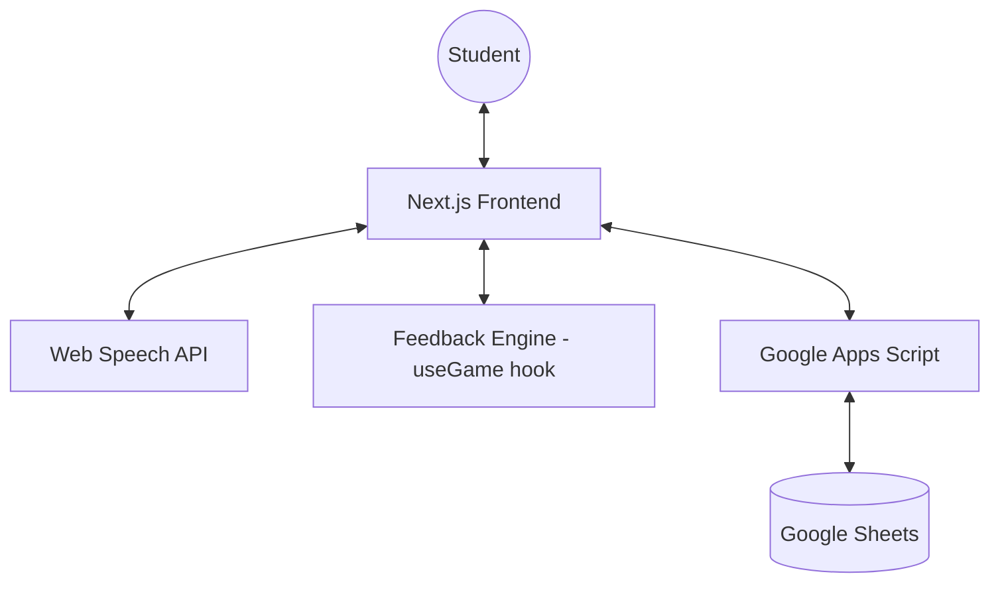

# System Patterns: Speak Check AI Lab

## System Architecture
Speak Check AI Lab is a client-side heavy React application (Next.js) that interacts with a lightweight serverless backend (Google Apps Script).

### Architecture Diagram (Simplified)

## Key Technical Decisions
1. **Next.js App Router:** Modern React framework for routing and server-side rendering (though this app is primarily client-side).
2. **Web Speech API:** Used for both Speech-to-Text (STT) and Text-to-Speech (TTS) to avoid external API costs and ensure low latency.
3. **Google Apps Script (GAS):** Used as a bridge between the frontend and Google Sheets. It provides a simple REST API for CRUD operations on student data and logs.
4. **Tailwind CSS + Neumorphism:** Provides a consistent, modern, and "soft" UI that is engaging for students.
5. **Custom Hooks for Logic:** Business logic is encapsulated in custom hooks (`useGame`, `useSpeech`, `useTTS`) to keep components clean and focused on UI.

## Design Patterns
- **Provider Pattern (Implicit):** State management is handled through hooks and passed down, maintaining a clear data flow.
- **Strategy Pattern:** The Feedback Engine (`useGame`) implements a strategy-like pattern to determine which feedback type to provide based on student performance.
- **State Machine:** The application moves through defined states (`SPLASH`, `LOGIN`, `DASHBOARD`, `PLAYING`, `FEEDBACK`, `RESULT`) and phases within a game (`PROMPT`, `LISTENING`, `PROCESSING`, `FEEDBACK`, `RESULT`).

## Component Relationships
- `page.tsx` is the main orchestrator, managing the top-level `GameState`.
- `Dashboard.tsx` allows navigation between different `GAME_MODES`.
- `GameScreen.tsx` is the primary interface for the 3 main game modes (Grammar, Vocab, Pronunciation).
- `NoticingRoom.tsx` is a specialized interface for the "Noticing" mode.
- `AliceAvatar.tsx` is a shared component that reflects the state and mood of the AI coach across different screens.

## Critical Implementation Paths
1. **Speech Processing Flow:**
   `GameScreen` -> `useSpeech` (start listening) -> `submitAnswer` (in `useGame`) -> `calculateScore` -> `determineFeedback` -> `AliceAvatar` (update mood/message) -> `useTTS` (speak feedback).
2. **Data Persistence Flow:**
   `useGame` (collect results) -> `api.ts` (send to GAS) -> Google Sheets (log progress).
3. **Authentication Flow:**
   `Login.tsx` -> `api.ts` (verify/create student) -> `localStorage` (persist session).